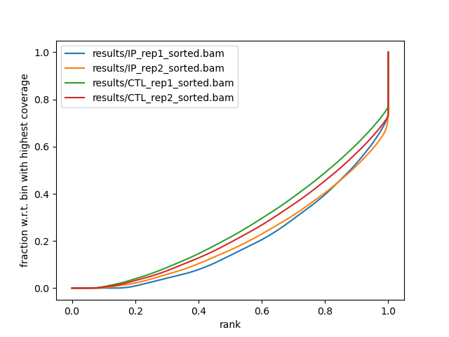
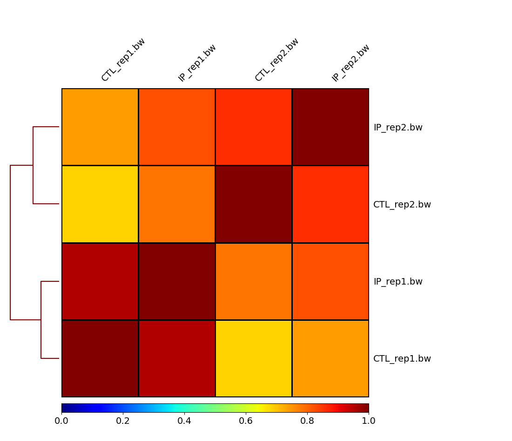
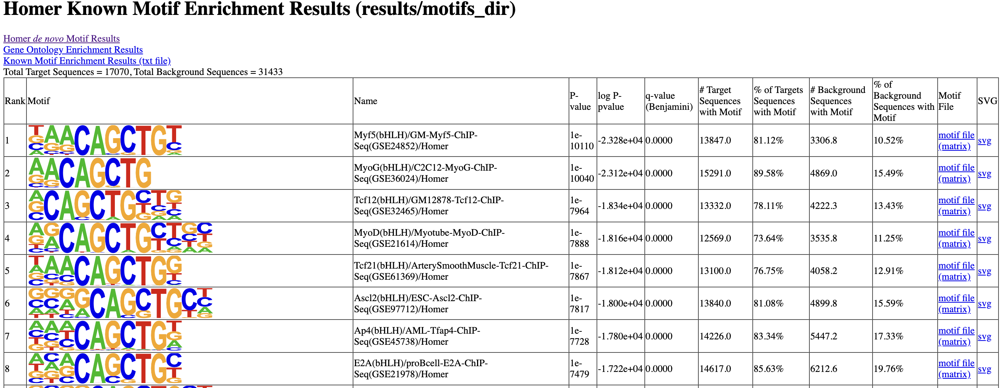
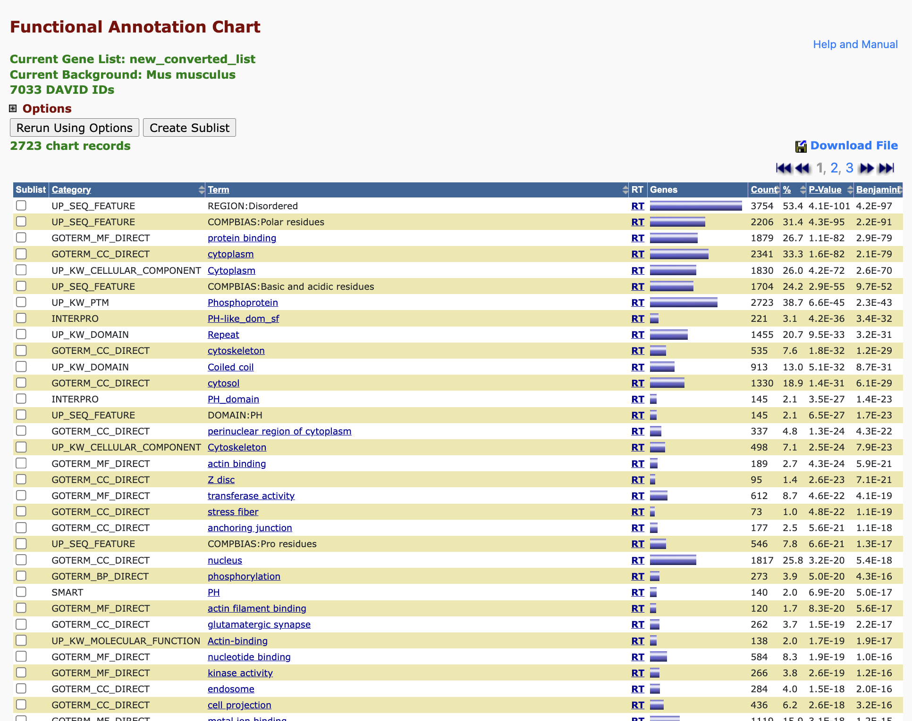

```{r setup, include=FALSE}
knitr::opts_chunk$set(echo = TRUE)
```

#1


Overall, after reviewing the MultiQC results, I do not observe any concerning aspects of quality control that would necessitate the exclusion of any samples from my analysis. Generally, there were not a concerning number of duplicates in each sample, which indicates minimal concern for PCR amplification bias. It appears that IP_rep1 had a lower number of reads compared to the rest of the samples. This could be attributed to sample-specific characteristics such as differences in genomic complexity. Reviewing the sequence quality histograms, all samples have PHRED scores greater than 25. It appears that IP_rep1 had the lowest PHRED score, around 25, while the other samples had PHRED scores greater than 30. Again, this could be due to sample-specific characteristics or technical artifacts. Generally, the PHRED scores are high for the samples, indicating reliable base calling in the sequencing data. Additionally, the GC content for all samples exhibits a uniform normal distribution. When examining the GC content of Mus musculus, the mouse genome typically has a GC content around 43%, and all reads showed a mean GC content of 40%. Therefore, I am not very concerned about contamination or certain molecules being more amplified.

#2

The fingerprint plot demonstrates the degree to which the signal in the ChIP-seq sample can be distinguished from the background distribution of reads in the control sample. The plot exhibits a uniform distribution of reads along the genome, with diagonal lines indicating infinite sequencing coverage. A pronounced ChIP enrichment is evident in the plot towards the end, characterized by a steep rise in the cumulative sum towards the highest rank. This suggests that a substantial number of reads from the ChIP sample are concentrated in a few bins, corresponding to high enrichments typically observed for transcription factors.

**Fingerprint Plot:**

```{r}

```

Initially, the correlation heatmap I generated displayed uniform color throughout. Upon closer examination, I discovered that certain regions in the genome exhibited exceptionally high signals, leading to artificial inflation of the Pearson correlation coefficients. After implementing the "removeOutliers" flag, the heatmap became more informative. It depicts the Pearson correlation coefficients of the signals generated from each of the samples. The heatmap reveals that the biological replicates accurately capture the transcription factor binding sites, with their signals represented in the bigwig format exhibiting very high correlation.

**Heatmap:**
```{r}

```

After performing peak calling, I found that there were 19139 peaks in the first biological replicate and 42162 peaks in the second biological replicate. I had 17394 peaks present in my set of reproducible peaks after applying my bedtools intersect strategy. The strategy I used consisted of each feature in the first paired replicate being compared to the second paired replicate in search of overlaps. After filtering out peaks overlapping blacklisted regions, I was left with 17069 peaks.

**Number of peaks called in each replicate, and the number of reproducible peaks**
```{r}
knitr::include_graphics("results/peaks.png")
```

**Motif Finding on Reproducible Peaks:**
```{r}

```

**Gene Enrichment Analysis on the Annotated Peaks:**
```{r}

```

**Factor of Interest Binding:**
```{r}
knitr::include_graphics("results/Piechart.png")
```


Based on the HOMER results, the transcription factor we are interested in is Myf5, which belongs to the helix-loop-helix family of transcription factors. This transcription factor plays a key role in regulating muscle differentiation or myogenesis, specifically in the development of skeletal muscle. Another transcription factor of interest is MyoG, also belonging to the helix-loop-helix family of transcription factors, and is similarly involved in myogenesis.

The functional annotation chart reveals that a significant number of peaks in the dataset were enriched for regions associated with protein-binding activity. This enrichment suggests that the genomic regions represented by these peaks are likely to be sites where proteins, potentially including Myf5 and MyoG, bind to regulate gene expression and contribute to the process of myogenesis. These findings support the hypothesis that Myf5 and MyoG may play important roles in the regulation of muscle differentiation and development, as indicated by their enrichment in protein-binding regions identified in the ChIP-seq dataset. 

The pie chart indicates that the transcription factors of interest predominantly bind to intronic and intergenic regions. This may be attributed to the fact that a significant portion of the genome comprises introns and intergenic regions that are not necessarily involved in direct cellular functions. However, it is noteworthy that the third most represented binding site is the promoter region. This observation aligns with the roles of Myf5 and MyoG in regulating muscle differentiation and development. Promoter regions are critical for initiating gene transcription, suggesting that Myf5 and MyoG may exert their regulatory effects on muscle-related genes by binding to these promoter regions and modulating their expression levels.


